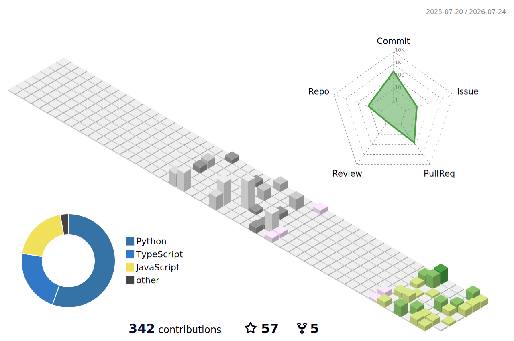

# 👋 Hello! My name is Alexandra!

I'm a **developer** learning Python 🐍 and web development. I enjoy creating convenient, beautiful and understandable applications.

### 🚀 What am I doing now?

* 🔥 Writing cool apps in Python and JavaScript
* 🎨 Creating nice and intuitive interfaces for my products
* 🗃️ Developing my own mini-game engine
* ​​📚 Incorporating AI agent systems into my work as assistants

---

### 🛠️ My tech stack:

---

### 📊 GitHub Contributions Calendar

---

### 📫 How to contact me:

* **Telegram:** [@nondeletable](https://t.me/nondeletable)
* **Email:** [nondeletable@gmail.com](mailto:nondeletable@gmail.com)

---

### 🌟 My best project:

* [ComfyLauncher](https://github.com/nondeletable/ComfyLauncher) - Browser for portable ComfyUI

---

✨ **Thanks for visiting! Enjoy browsing my GitHub!** ✨
